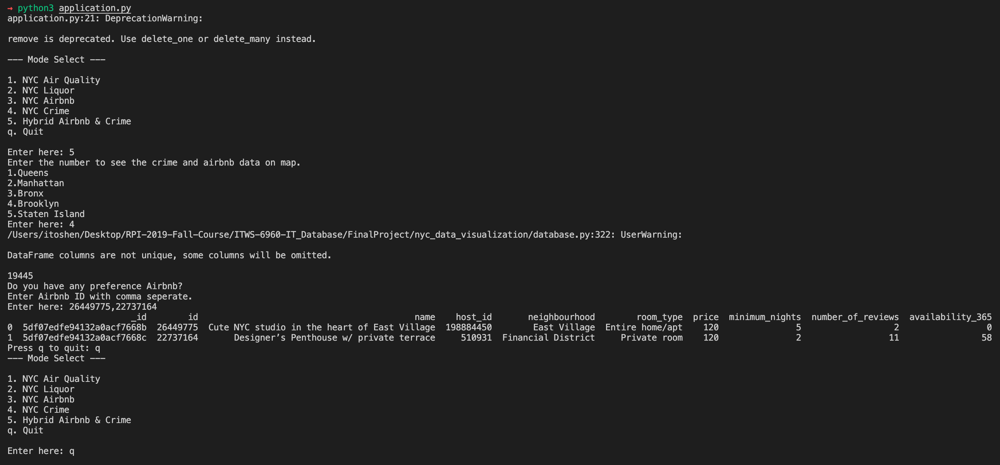

# NYC Data Visualization

## Purpose

Through this project, we planned to find out the relations within some datasets of New York City: the crime dataset, the liquor store dataset, the air quality dataset and the Airbnb dataset. Because we think some of the factors referred to above may have effects on the others. For instance, the location where many crimes are spotted may have much liquor authority, and more Airbnb houses may locate in the place with higher air quality.

## Requirement
- Python3
- **MongoDB**
- **PostgreSQL**
- Pandas
- **Plotly** 
- psycopg2
- pymongo

## Usage
### 1. Set up the Database
Open up any terminal app (e.g. macOS - Teriminal.app, Windows - CMD and etc.), 

#### Postgres
- Windows: Use the Postgres Installer wizard
- macOS: 
	
	```
	brew install postgres
	pg_ctl -D /usr/local/var/postgres start
	```
	
- Linux:
	- Debian: `sudo apt insatll postgres-11`
	- SUSE15: `sudo zypper install postgres`

	Start up: `sudo service postgresql start`

#### MongoDB
- Windows: Use the MongoDB Installer wizard
- macOS: 
	
	```
	brew tap mongodb/brew
	brew install mongodb-community@[VERSION]
	brew services restart mongodb/brew/mongodb-community@[VERSION]
	```	
	
- Linux:
	- Debian (Debian 9/10): 

		```
		# if receive an error indicating that gnupg is not installed
		# sudo apt-get install gnupg
		wget -qO - https://www.mongodb.org/static/pgp/server-4.2.asc | sudo apt-key add - 
		sudo service mongod start
		```
		
	- SUSE (SUSE15): 
		
		```
		sudo zypper addrepo --gpgcheck "https://repo.mongodb.org/zypper/suse/15/mongodb-org/4.2/x86_64/" mongodb
		sudo zypper -n install mongodb-org
		sudo service mongod start
		```

### 2. Import Data
Change the current directory to this repo's **root** directory and<br>
Create new **Database**: `psql -U postgres postgres < ./setup/setup.sql`<br>
Create new **Tables**: `psql -U project project < ./setup/schema.sql`<br>
**Import** the csv file into database: `python3 ./setup/csv_to_psql.py`<br>

### 3. Start up the application
Use command `python3 application.py` at the same directory, and the terminal will show the **options**: Get use of different functions by typing in the correspond number (Or `q` for quitting)

1. When selected `NYC Air Quality`, it will display:<br>
	- `UHF42`<br> NYC air quality statics by UHF42
	- `Borough`<br> NYC air quality statics by Borough
	- `Quit`: Get back to the topper menu

2. When selected `NYC Liquor`, it will display displayed:<br> 
	- `NYC liquor statics by month on map`<br>
		- Users can type in `[YEAR]-[MONTH]` in this fixed format to check out the effecive liquor license's distribution in NYC in that month.
	- `NYC liquor statics by year on map`<br>
		- Users can type in `[YEAR]` to check out the effecive liquor license's distribution in NYC in that year.
	- `NYC liquor statics overall on map`<br>
		- Users can check out all the liquor licenses' distribution in NYC in history.
	- `Quit`: Get back to the topper menu.

3. When selected `NYC Airbnb`, it will display<br>
	- `NYC Airbnb statics by minimum nights on map`
		- Users can check out the Airbnb room's distribution by minimum nights (amount of nights minimum) in NYC.
	- `NYC Airbnb statics by availability on map`
		- Users can check out the Airbnb room's distribution by availability (available days in one year) in NYC.
	- `NYC Airbnb statics by reviews on map`
		- Users can check out the Airbnb room's distribution by review amount in NYC. 
	- `Quit`: Get back to the topper menu.

4. When selected `NYC Crime`, it will displayed<br>
	- `Crime statics by crime`
		- Users can check out the crime's amount distribution in NYC by amount in history by year.  
	- `Crime statics by months`
		- Users can check out the crime's amount distribution in NYC by amount in history by month. 
	- `Crime statics by hours`
		- Users can check out the crime's amount distribution in NYC by amount in history by hour. 
	- `Crime statics by map`
		- Users can check out the crime's amount distribution in NYC by amount in history on the map.  
	- `Quit`: Get back to the topper menu.


5. When `Hybrid Airbnb & Crime` displayed<br>
	- Users can choose one target region in NYC from `Queens`, `Manhattan`, `Bronx`, `Brooklyn`, `Staten Island` and check out the hybrid map with the distribution of Airbnb and Crime
	- Users can add some Favorite Airbnb points (ID) on the map
	
6. `Quit`: Quit the application

## Demo



## Reference Dataset

1. **Liquor Authority Quarterly List of Active Licenses API**
    - Location of data: <https://data.ny.gov/Economic-Development/Liquor-Authority-Quarterly-List-of-Active-Licenses/wg8y-fzsj>
    - License: Public
2. **New York City Airbnb Open Data**
    - Location of data: <https://www.kaggle.com/dgomonov/new-york-city-airbnb-open-data#AB_NYC_2019.csv>
    - License: CC0: Public Domain *(No copyright)*
3. **New York City Crimes**
    - Location of data: <https://www.kaggle.com/adamschroeder/crimes-new-york-city#NYPD_Complaint_Data_Historic.csv>
    - License: CC0: Public Domain *(No copyright)*
4. **New York City Air Quality**
    - Location of data: <https://www.kaggle.com/new-york-city/new-york-city-air-quality#air-quality.csv>
    - License: CC0: Public Domain *(No copyright)*


